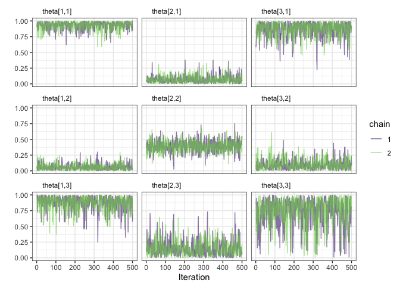

<!-- README.md is generated from README.Rmd. Please edit that file -->

<!-- [](https://Travis-ci.com/baruuum/relabelKL) -->
<!-- [](https://ci.appveyor.com/project/baruuum/relabelKL) -->
<!-- [](https://codecov.io/github/baruuum/relabelKL?branch=master) -->
<!-- badges: start -->
[](https://github.com/baruuum/relabelKL/actions/workflows/R-CMD-check.yaml)
<!-- badges: end --> [](https://www.gnu.org/licenses/gpl-3.0)

## C++ implementation of the relabeling method proposed by Stephens(2000)

While the relabeling algorithm proposed in Stephens (2000) has been
shown to perform well in dealing with the label switching phenomenon in
Bayesian finite mixture models and has the attractive feature of
requiring no additional information beyond the posterior samples, it has
been pointed out that it is computationally expensive. Currently, the
`label.switching::stephens` function provides the only `R`
implementation of Stephens’ method. Yet, the function is rather slow,
which makes it impractical to use on MCMC output of moderate size.

The `relabelKL` package is a `C++` implementation of Stephen’s
relabeling algorithm. It is implemented using the [Armadillo
library](http://arma.sourceforge.net/) and sourced via the
`RcppArmadillo` package. If available, the functions provided will use
OpenMP to run parts of the code in parallel. The package provides also a
set of helper functions to facilitate the integration with `stanfit`
objects produced via the `rstan` package.

A comparison between the performance of the `label.switching::stephens`
function and the `relabelKL::relabelMCMC` function is provided at the
end of this document.

## Installing the package

Using the `devtools` package, the developmental version of `relabelKL`
can be installed from github:

``` r
devtools::install_github("baruuum/relabelKL")
library(relabelKL)
```

Mac OS users might experience compiling issues due to the OpenMP
dependency. To set up the machine and install the necessary compiling
tools, follow the instructions in [this
page](https://thecoatlessprofessor.com/programming/cpp/r-compiler-tools-for-rcpp-on-macos/).

## Using the Package

Relabeling MCMC output is done by the `relabelMCMC` function. The
function takes as input an array of dimensions `S`\*`N`\*`K`, where `S`
is the number of posterior draws, `N` the number of units/individuals,
`K` the latent classes/categories/types to which they belong, and the
entries are either probabilities or log-probabilities of unit
`i = 1,2,...,N` belonging to one of the `k=1,2,..,K` classes/types.

Three options might be specified:

1.  `log_p`: whether the entries are log-probabilities or probabilities
    (defaults to `log_p = TRUE`)
2.  `renormalize`: if `TRUE` renormalizes the rows of each slice of `x`
    to sum to one
3.  `maxit`: the number of maximum iterations (defaults to
    `maxit = 100`)
4.  `nthreads`: number of threads to use in calculation (if OPENMP is
    enabled)
5.  `verbose`: whether intermediate results should be printed (defaults
    to `verbose = TRUE`); and

Calling `relabelMCMC` on the array `x`

``` r
res = relabelMCMC(x)
```

returns a `list` of four elements:

1.  `permuted`: the same object as `x` but with the columns of each
    posterior draw relabeled
2.  `perms`: a `S \times K` matrix which contains, for each draw, the
    optimal permutation. That is, the `s`th row of `perms` shows how the
    `s`th posterior draw was permuted, so that applying the permutation
    in `perms` to the initial array, `x`, will result in the relabeled
    array
3.  `iterations`: the number of iterations for which the algorithm was
    run
4.  `status`: which is `0` if the algorithm has successfully converged
    and `1` otherwise

## Relabeling other parameters of the model

There are often other parameters in the model that depend on the
labeling of the latent classes / extreme types. The `permuteMCMC`
function can be used in this situation. For an three-dimensional array,
`y`, where the last dimension correspond to `S` posterior draws, the
`permuteMCMC` can be called based on the results from the `relabelMCMC`
output (or for any other relabeling algorithm that returns the
permutation mapping). Calling, for example,

``` r
y_relabeled = permuteMCMC(y, perms = res$perms, what = "dimension to permute")
```

will permute the either the rows, columns, or both the rows and columns
of each of the `S` sub-arrays of `y` based on `res$perms`.

1.  Three strings might be passed to the `what` option: specifying
    `"rows`” will permute the rows of each `s=1,2,...,S` draw,
    specifying `"cols"` will permute the columns, and `"both"` will
    permute both the rows *and* columns.
2.  It is important to notice that the `permuteMCMC` function assumes
    that the first index of a three dimensional array represents the
    posterior draws, so that entering an array of dimensions, say,
    `N`\*`B`\*`S` will lead to undefined behavior.
3.  When a two-dimensional matrix, instead of a three-dimensional array,
    is passed to `permuteMCMC`, it is assumed that it has dimensions
    `S`\*`K` and, the function will always permute the columns.

## Relabeling when true assignment probabilities are known

If the “true” labels of a stochastic blockmodel or latent class model
are known in advance, assigning each individual to their true class is
straightforward. Yet, there are situations in which we want to make the
assignment probabilities of each posterior draw as close as possible to
a set of known/true probabilities. These situations arise, for example,
when MAP or MLE estimates of the membership vectors of mixed membership
models are calculated and when we want to use them as a pivots to
relable the MCMC samples. In these cases, the `relabelTRUE` function
might be used as follows:

``` r
rel_true = relabelTRUE(x = x, x_true = x_true, verbose = F, log_p = F)
```

where `x_true` is a `N`\*`K` matrix of “true” assignment probabilities /
mixed membership vectors. This function will try to relabel each
posterior draw in `x` as close as possible to `x_true` in terms of
KL-distances. When the `log_p` option is set to `TRUE`, *both* `x` and
`x_true` should be entered on the log-scale. Otherwise, the function
will throw an error.

## Functions to use with `rstan` objects

The package comes with one dataset called `mmsbm`, which is a `stanfit`
object obtained from running a mixed membership stochastic blockmodel on
simulated data. The model has two parameters: `pi`, a matrix the mixed
membership vectors, where each row indicates the probability of
individual `i = 1,2,..,N` enacting type `k = 1, 2, ..., K` in the
interaction process, and `theta` the so-called image matrix, which is of
dimensions `K`\*`K` and reflects the association tendencies between the
`K` pure types.

The data can be loaded as

``` r
library(relabelKL)
#> relabelKL version 0.0.1
data(mmsbm)
```

The `relabelKL` package provides a wrapper function to extract posterior
samples from a `stanfit` object and rearrange the parameter draws so
that it can be directly passed to the `relabelMCMC` function.

Calling

``` r
pi_arr = extract_n_combine(mmsbm, par = "pi")
```

will combine post-warmup draws across all MCMC chains into the first
dimension of a three-dimensional array, where the other dimensions are
identical to the dimensions specified in the `Stan` program. For
example, if `pi` was specified as a `matrix[L,M]` object, the first
dimension of `pi_arr` will be of order `S*J`, where `S` is as before the
number of post-warmup draws and `J` the number of MCMC chains, and the
two last dimensions of the extracted object will be `L` and `M`.

For the `mmsbm` dataset, calling `extract_n_combine` results in an array
of dimensions

``` r
dim(pi_arr)
#> [1] 1000   30    3
```

This object, then, can be passed to `relabelMCMC` or `permuteMCMC` as
follows:

``` r
rel = relabelMCMC(pi_arr, maxit = 50L, verbose = TRUE, log_p = FALSE)
#> 
#> Starting Fixed-Point Iterations ... 
#> 
#> Iteration : 0,   Mean KL-divergence : 8.871
#> Iteration : 1,   Mean KL-divergence : 8.030
#> Iteration : 2,   Mean KL-divergence : 6.107
#> Iteration : 3,   Mean KL-divergence : 4.403
#> Iteration : 4,   Mean KL-divergence : 4.402
#> Iteration : 5,   Mean KL-divergence : 4.402
#> Iteration : 6,   Mean KL-divergence : 4.401
#> Iteration : 7,   Mean KL-divergence : 4.401
#> Iteration : 8,   Mean KL-divergence : 4.401
#> Iteration : 9,   Mean KL-divergence : 4.401
#> Converged!   ( Final KL-divergence : 4.401 )
```

The `rel$permuted` will contain the relabeled `pi` array, and we can
apply the same permutations on other parameters by using the `rel$perms`
object, which contains the permutations applied to the original MCMC
output:

``` r
# get permuted labels
rel_pi_arr = rel$permuted

# extract image matrix from stanfit object
theta_arr = extract_n_combine(mmsbm, par = "theta")

# apply same permutation to theta
rel_theta_arr = permuteMCMC(theta_arr, rel$perms, "both")
```

Lastly, to monitor the convergence of the relabeled posterior draws, we
have to transform the relabeled arrays into a form that can be passed to
the `rstan::monitor` function. This can be done by using the
`to_stan_array` function as follows:

``` r
# monitor convergence of original output
rstan::monitor(to_stan_array(theta_arr))
#> Inference for the input samples (2 chains: each with iter = 500; warmup = 250):
#> 
#>             Q5 Q50 Q95 Mean  SD  Rhat Bulk_ESS Tail_ESS
#> theta[1,1] 0.4 0.9 1.0  0.8 0.2  1.02      121      143
#> theta[2,1] 0.0 0.4 1.0  0.5 0.4  1.82        3       64
#> theta[3,1] 0.0 0.5 1.0  0.5 0.4  1.84        3      134
#> theta[1,2] 0.0 0.3 1.0  0.5 0.4  1.83        3      267
#> theta[2,2] 0.3 0.5 1.0  0.6 0.3  1.43        5      225
#> theta[3,2] 0.0 0.1 0.3  0.1 0.1  1.02      162      160
#> theta[1,3] 0.0 0.5 1.0  0.5 0.4  1.82        3      129
#> theta[2,3] 0.0 0.1 0.3  0.1 0.1  1.01      201      300
#> theta[3,3] 0.3 0.5 1.0  0.6 0.3  1.52        4      161
#> 
#> For each parameter, Bulk_ESS and Tail_ESS are crude measures of 
#> effective sample size for bulk and tail quantities respectively (an ESS > 100 
#> per chain is considered good), and Rhat is the potential scale reduction 
#> factor on rank normalized split chains (at convergence, Rhat <= 1.05).

# same statistics for the relabeled output
rstan::monitor(to_stan_array(rel_theta_arr))
#> Inference for the input samples (2 chains: each with iter = 500; warmup = 250):
#> 
#>             Q5 Q50 Q95 Mean  SD  Rhat Bulk_ESS Tail_ESS
#> theta[1,1] 0.8 1.0 1.0  0.9 0.1  1.00      397      351
#> theta[2,1] 0.0 0.1 0.2  0.1 0.1  1.00      373      319
#> theta[3,1] 0.6 0.9 1.0  0.9 0.1  1.00      359      316
#> theta[1,2] 0.0 0.0 0.2  0.1 0.1  1.00      540      388
#> theta[2,2] 0.3 0.4 0.5  0.4 0.1  1.00      601      422
#> theta[3,2] 0.0 0.1 0.3  0.1 0.1  1.00      330      303
#> theta[1,3] 0.6 0.9 1.0  0.9 0.1  1.00      271      212
#> theta[2,3] 0.0 0.1 0.4  0.1 0.1  1.00      239      260
#> theta[3,3] 0.2 0.8 1.0  0.7 0.2  1.03      148      310
#> 
#> For each parameter, Bulk_ESS and Tail_ESS are crude measures of 
#> effective sample size for bulk and tail quantities respectively (an ESS > 100 
#> per chain is considered good), and Rhat is the potential scale reduction 
#> factor on rank normalized split chains (at convergence, Rhat <= 1.05).
```

Similarly, `traceplot` might be inspected by using

``` r
array_traceplot(to_stan_array(rel_theta_arr), par = "theta")
```



## Comparison to `label.switching::stephens`

A simple comparison with the `stephens` function of the
`label.switching` package might offer some insights into the efficiency
gains. We first draw some random vectors that sum to one using the
Dirichlet distribution.

``` r
# set seed and dimensions
set.seed(123)
x = extract_n_combine(mmsbm, "pi")
```

Now, rigorous benchmarking will be super time-consuming; but as the
difference in speed are quite large, we might use the `Sys.time()`
function to get a sense of the efficiency gain. First, we use the
`stephens` function of the `label.switching` package:

``` r
# fit label.switching::stephens
start_t = Sys.time()
res1 = label.switching::stephens(x)
end_t = Sys.time()
print(end_t - start_t)
#> Time difference of 3.806669 secs
```

Next, we use the `relabelMCMC` function:

``` r
# fit relabelKL::relabelMCMC
start_t = Sys.time()
res2 = relabelKL::relabelMCMC(x, maxit = 100L, verbose = FALSE, log_p = FALSE)
end_t = Sys.time()
print(end_t - start_t)
#> Time difference of 0.2090929 secs
```

and with multiple threads

``` r
# fit relabelKL::relabelMCMC
start_t = Sys.time()
res3 = relabelKL::relabelMCMC(x, maxit = 100L, verbose = FALSE, nthreads = 2L, log_p = FALSE)
end_t = Sys.time()
print(end_t - start_t)
#> Time difference of 0.211798 secs
```

Lastly, we check can check that the results are indentical:

``` r
sum(res1$permutations != res2$perms)
#> [1] 0
sum(res1$permutations != res2$perms)
#> [1] 0
```

## References

Stephens, M. 2000. “Dealing with label Switching in mixture models,”
*Journal of the Royal Statistical Society Series B*, 62, 795-809.
